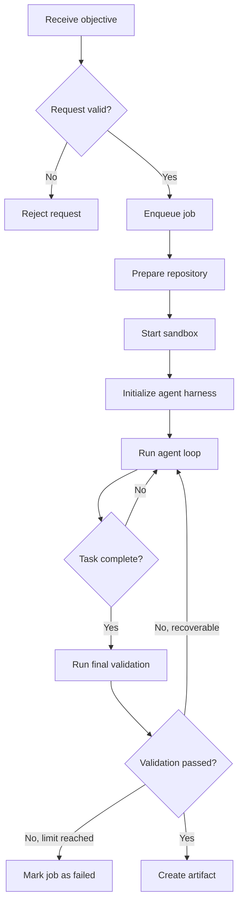
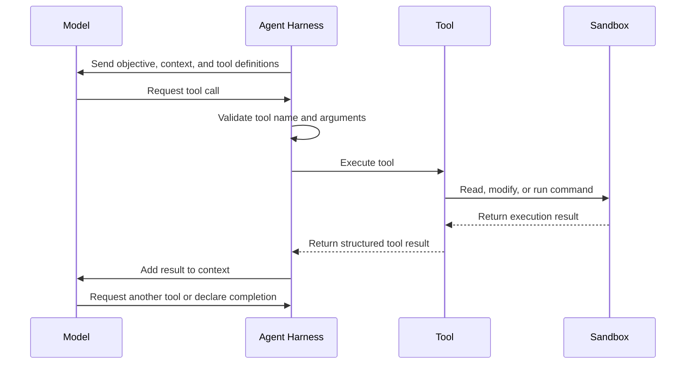
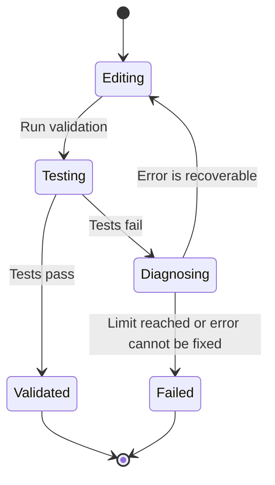
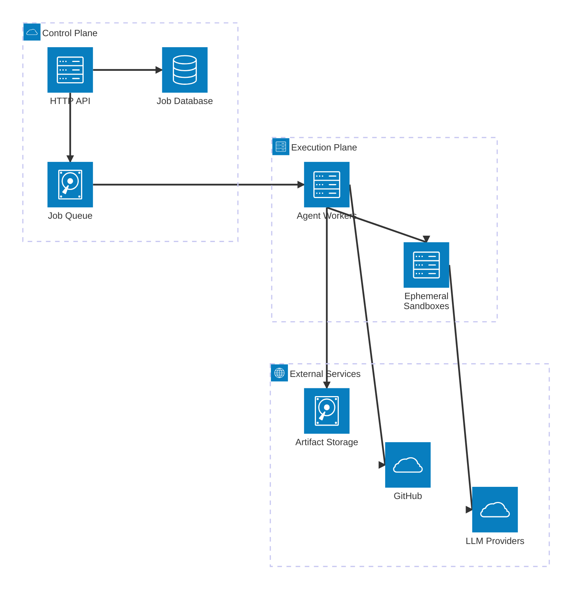
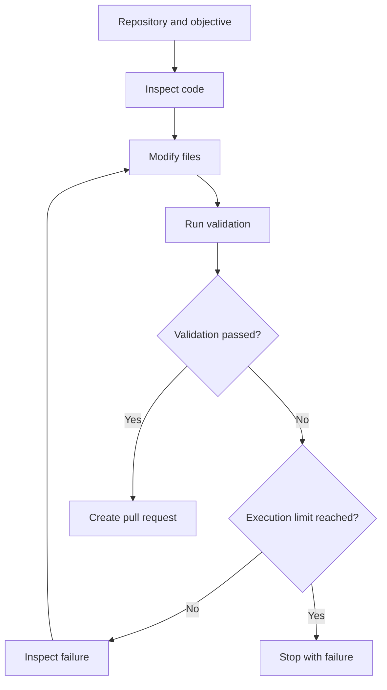

We wanted [BugLady](https://buglady.ai/) to take a software requirement and turn it into a pull request without requiring a developer to run an agent locally.

BugLady helps agencies and software teams translate client requests into work engineers can act on. The next step was obvious: instead of stopping at a clarified requirement, could the system implement it?

The first version of the idea was simple: run Claude Code on a server. But moving a coding agent from a developer’s laptop into the cloud changes the problem. You now need isolated execution, job scheduling, credentials, validation, failure recovery, and a controlled way to publish the result.

This article explains the architecture behind that system and the decisions involved in building one. Here is a short walkthrough of it in action:

<iframe src="https://www.youtube.com/embed/vI58bDkONGo?si=M28eX4K4A8uzInOE" title="YouTube video player" frameborder="0" allow="accelerometer; autoplay; clipboard-write; encrypted-media; gyroscope; picture-in-picture; web-share" referrerpolicy="strict-origin-when-cross-origin" allowfullscreen></iframe>

## What is a cloud agent?

A cloud agent is a program that runs remotely, uses an LLM and a set of tools to perform a task, and produces an artifact or side effect.

It usually needs five things:

* An LLM
* Tools
* An execution loop
* Remote execution
* A definition of completion

The remote part matters. The agent might run on your own server, Kubernetes, Railway, Fly.io, AWS, or another compute platform. What makes it a cloud agent is that the work happens in a managed environment rather than on the user’s machine.

The distinction is not simply “ChatGPT versus an agent.” Interactive assistants respond to individual messages. A cloud agent receives an objective and continues working until it completes the task, reaches a limit, or fails.

For BugLady, the objective might be:

> Add pagination to the users endpoint and include tests.

The result is not an explanation of how to add pagination. The result is a branch containing the implementation, passing tests, and a pull request ready for review.

## Why build one?

A cloud agent becomes useful when you want AI to participate in an existing workflow rather than wait for someone to open a chat window, paste context, and manually apply the response.

A coding agent can implement a small feature or fix a bug. Other agents might update documentation after a release, normalize data inside a pipeline, categorize images, moderate submissions, or process internal support requests.

These jobs have a few things in common. They take time, require access to tools or data, and need to produce something another system can consume.

You could ask an interactive assistant to help with each step, but somebody would still have to coordinate the work. A cloud agent lets the workflow call the agent directly and receive a result later.

## Follow one request through the system

The easiest way to understand the architecture is to follow a single request.

A user clicks a button asking BugLady to implement a requirement. The API validates the request and places it in a queue. A worker receives the job, prepares the repository, starts an isolated environment, and initializes the agent harness.

The harness gives the model access to tools. The model inspects the repository, edits files, runs commands, reads the results, and decides what to do next. This continues until the implementation passes validation or the run reaches one of its limits.

When the task succeeds, the service extracts the repository changes and opens a pull request through a GitHub App.

The lifecycle looks roughly like this:



Each box introduces a separate engineering concern.

## The API

An HTTP API is enough to receive most agent requests.

For our coding agent, a job looked similar to this:

```json
{
  "repository": "owner/project",
  "base_branch": "main",
  "goal": "Add pagination to the users endpoint and include tests",
  "model": "openai/gpt-5.6-terra",
  "provider": "openai",
  "limits": {
    "timeout_minutes": 30,
    "max_iterations": 40,
    "max_cost_usd": 5
  }
}
```

The API should reject requests the agent is not supposed to process. That includes invalid repositories, unsupported providers, unknown branches, excessive limits, and objectives from users who do not have access to the project.

Treat the request as untrusted input. The goal eventually reaches a model with access to files and commands, so authorization and validation belong at the beginning of the system, not inside the prompt.

Limits can be supplied per request or configured by the service. Per-request limits are useful when different jobs have different risk or complexity. Service-level limits are easier to govern.

## The queue

Agent jobs rarely finish within the lifetime of a normal HTTP request. A coding task might take several minutes, especially when the agent needs to install dependencies, inspect a large repository, run tests, or recover from an error.

The API should accept the request, create a job record, enqueue it, and return a job identifier. A worker can then process it independently.

The queue also controls concurrency. Without one, a burst of requests could start too many containers at once and exhaust memory, CPU, provider rate limits, or your budget.

At a minimum, the job system should track:

* Queued, running, completed, failed, and cancelled states
* Attempt count
* Start and completion timestamps
* The current execution stage
* Failure reason
* Produced artifacts
* Token, compute, and cost usage

Retries should be selective. Retrying after a temporary provider error makes sense. Retrying the same failing test suite five times without changing anything does not.

## The sandbox

The agent needs somewhere to work. That environment should be isolated from the host and from other jobs.

We used Docker containers. For the first supported stacks, we maintained images for Node.js, Ruby, C#, Go, and Java. Before starting the agent, the service inspected files such as `package.json`, `Gemfile`, project files, or build configuration to choose an image.

Automatic detection works for common repositories. Complex projects eventually need an explicit configuration file. We added a `buglady.conf` file so a repository could declare its runtime, setup commands, validation commands, and other requirements instead of relying entirely on detection.

When starting a container, the service decides:

* Which image and dependency versions to use
* How much CPU and memory the job receives
* Which directories the agent can access
* Which volumes are mounted
* Which environment variables are available
* Which network addresses the container can reach
* How long the process may run

Isolation protects the host, but it also makes runs reproducible. A task should not succeed or fail because one worker happens to have a different version of Node, a globally installed package, or a leftover file from another run.

An ephemeral sandbox starts from a known state and disappears when the job ends.

## The agent harness

The agent harness is the runtime at the center of the system.

It repeatedly sends the model the current context, receives either text or a tool request, executes the requested tool, returns the result, and decides whether the loop should continue.

In simplified form:



The harness also manages the conversation state, iteration limits, cancellations, provider calls, tool schemas, logging, and completion conditions.

You can build this loop yourself, but for a coding agent there is little reason to begin from zero. Existing harnesses already handle common filesystem, shell, and code-editing workflows.

We considered the Claude Code SDK, OpenCode, and Pi Mono. We chose Pi Mono because it was lightweight and exposed an API that fit the way we wanted to control execution. Model independence also mattered because we wanted to use different providers without rebuilding the surrounding system.

Framework choice should follow the task. A general workflow agent may need structured state and custom business tools. A coding agent benefits from a harness already designed to inspect repositories, modify files, and run commands.

## Tools

Tools are the operations the model can request.

For a coding agent, they commonly include:

```text
read_file
write_file
search_code
list_directory
run_command
apply_patch
```

You might also expose tools for browsing documentation, querying an issue tracker, reading an internal API, or reporting progress.

A tool is not code the model executes directly. It is a capability registered with the harness using a name, description, and input schema.

The interaction works like this:

1. The model receives the task, context, and available tool definitions.
2. It decides that it needs a tool.
3. It returns a structured request containing the tool name and arguments.
4. The harness validates the request.
5. The tool executes inside the allowed environment.
6. The harness sends the result back to the model.
7. The model decides what to do next.

Suppose the model wants to inspect a controller:

```json
{
  "tool": "read_file",
  "arguments": {
    "path": "app/controllers/users_controller.rb"
  }
}
```

The harness checks that the path is allowed, reads the file from the sandbox, and returns its contents. The model may then request an edit, run the tests, inspect an error, and edit the code again.

Tool descriptions matter because the model uses them to decide when and how to call each tool. But descriptions are not security boundaries. The runtime still needs to validate paths, arguments, command duration, output size, and permissions.

## How the agent works with a repository

When a worker receives a coding job, it clones the repository using credentials with the minimum required access. It checks out the requested base branch and creates a new branch following our branching convention.

The repository is mounted into the container. The harness exposes it to the model through filesystem and command tools while keeping execution inside the sandbox.

The model can now inspect the codebase, identify the relevant files, implement the change, and run the project’s validation commands.

The harness should focus on modifying and validating the repository. GitHub credentials do not need to exist inside the agent container. Once the run finishes, the outer service can inspect the changes, create the commit, push the branch, and open the pull request.

This separation reduces what a compromised or confused agent can access. The agent needs the code and the tools required to work on it. It does not necessarily need permission to publish anything.

## Validation

Validation is what separates a demonstration from a system you can place inside a real workflow.

For BugLady, validation could include:

* The project installs successfully
* The application compiles
* Existing tests pass
* New tests are present when required
* Linting and type checks pass
* The repository contains actual changes

A validation failure should not always end the run immediately. The result can be returned to the model so it can inspect the error and try to fix it.

For example:



Validation depends on the job. A data-processing agent may validate against a schema, compare record counts, or reject output with missing fields. An extraction agent might require source references for every returned value. An image-processing agent might check dimensions, file format, and moderation results.

Do not treat a model saying “the task is complete” as evidence that the task is complete. Completion should be tied to conditions the system can verify.

## Artifacts

The artifact is the result that leaves the agent system.

For a coding agent, it is usually a commit or pull request. Other agents might create a document, upload files to object storage, write records to a database, call another service, or draft an email.

The artifact should preserve enough context for a person or downstream system to evaluate it. A pull request might include the original objective, changed files, validation commands, results, and any limitations reported by the agent.

Keep artifact creation outside the model whenever possible. The model can prepare the content, but deterministic application code should upload the file, create the pull request, or call the next service.

## Recovering from failures

A cloud agent has more failure modes than a normal request-response application because it depends on a model, external providers, tool execution, containers, project dependencies, and task-specific validation.

Some failures are temporary:

* Provider timeout
* Rate limit
* Failed image pull
* Network interruption
* Queue worker crash

These may be retried with backoff.

Others require the agent to react:

* Compilation error
* Failed test
* Invalid output shape
* Missing dependency
* Malformed tool arguments

The harness can return the error to the model and allow another iteration.

Some failures should stop the job:

* Timeout reached
* Maximum iterations reached
* Cost limit reached
* Repeated identical tool calls
* Forbidden network or filesystem access
* Container resource limit exceeded
* User cancellation
* Validation continues to fail after the allowed attempts

Store the execution state outside the container. If the worker crashes, you should still know which job was running, how far it reached, and whether it can be resumed or must restart.

Logs also need structure. A long transcript of model messages and shell output is difficult to debug. Record events such as sandbox creation, tool call, command exit, validation attempt, provider error, and artifact creation separately.

One useful protection is loop detection. If the model runs the same failing command several times without changing the relevant files, the harness can stop the run or send a corrective instruction.

## Cost

The model is the most visible cost, but it is not the only one.

Each job may consume:

* Input and output tokens
* Container CPU and memory
* Dependency downloads
* Repository cloning bandwidth
* Network access
* Logs and execution traces
* Artifact storage
* Queue and database resources

Coding agents can repeatedly send large portions of a repository or conversation history to the model. Context management therefore affects cost as much as model choice.

Track usage per job rather than looking only at the provider’s monthly invoice. You should be able to answer how much one successful task costs, how much failed runs cost, which repositories consume the most resources, and whether retries are improving results or wasting money.

Budgets should be enforced by the runtime. A prompt asking the model to remain under five dollars is not a budget control. The service must count usage and terminate the run when it reaches the configured limit.

Cost also influences architecture. Keeping a warm pool of containers can reduce startup time but consumes resources while idle. Building dependencies during every run is simpler but slower and more expensive. Prebuilt images improve speed, although maintaining many language and framework combinations creates its own work.

## Deployment

A first deployment does not need Kubernetes.

A practical version can run with:



The API receives requests and exposes job status. The database stores jobs, limits, state, and results. The queue assigns work to workers. Each worker starts an isolated container for one job and destroys it afterward.

The worker host needs strict boundaries because it executes code from repositories and commands selected by a model. Avoid mounting the Docker socket into an agent container. Do not expose host credentials. Restrict outbound traffic and run containers without root privileges where possible.

As usage grows, the API, queue, and workers can scale independently. Coding jobs may also need separate worker pools for different resource profiles. A small documentation update does not require the same memory or timeout as compiling a large Java project.

The first scaling problem is often not request volume. It is environment diversity. Supporting five programming languages means supporting many package managers, versions, native dependencies, test commands, and project structures.

That work belongs in the design from the beginning. The model can write code only after the environment can run it.

## External knowledge

Not every agent needs retrieval-augmented generation.

Some tasks require only the request and the files already available in the sandbox. Others need access to documentation, databases, internal APIs, object storage, or an MCP server.

Treat external knowledge as another controlled capability. Give the agent access only to the sources required for the task, and return structured results where possible.

For a coding agent, browsing can help when it needs current framework documentation. It also introduces network risk, prompt injection risk, nondeterministic content, and additional cost. In repositories with enough local documentation, disabling general internet access may produce a more controlled run.

## What matters most

The model is only one component of a cloud agent.

The harder engineering work is around it: preparing reproducible environments, exposing narrow tools, enforcing limits, validating results, recovering from failures, and publishing artifacts safely.

For our use case, the central loop was straightforward:



Everything else exists to make that loop reliable enough to run without a developer supervising every command.

## Conclusion

Building a cloud agent is less about prompting a model and more about designing a system that can safely and reliably let that model act.

The difference between a demo and a production-ready agent is control: control over execution environments, over what the agent can access, over how it spends time and money, and over how its output is validated and delivered.

If you get those pieces right, the model becomes a powerful component rather than a fragile dependency. It can operate inside real workflows, produce artifacts that teams trust, and handle tasks without constant human supervision.

Cloud agents are still early, and many patterns are evolving. But the core idea is already clear: instead of asking AI for answers, we can give it responsibility for outcomes.
