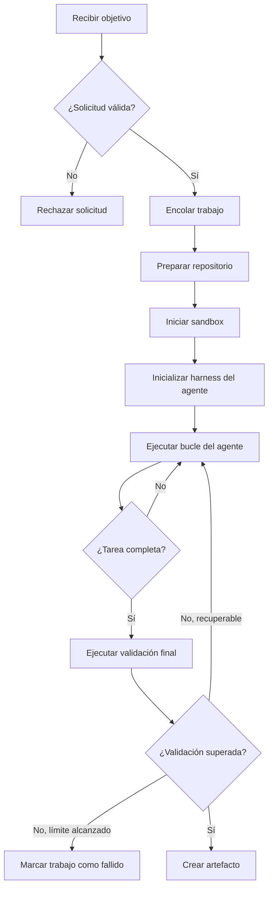
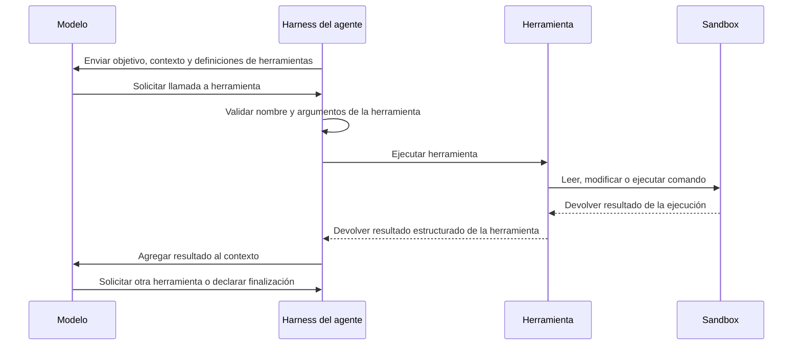
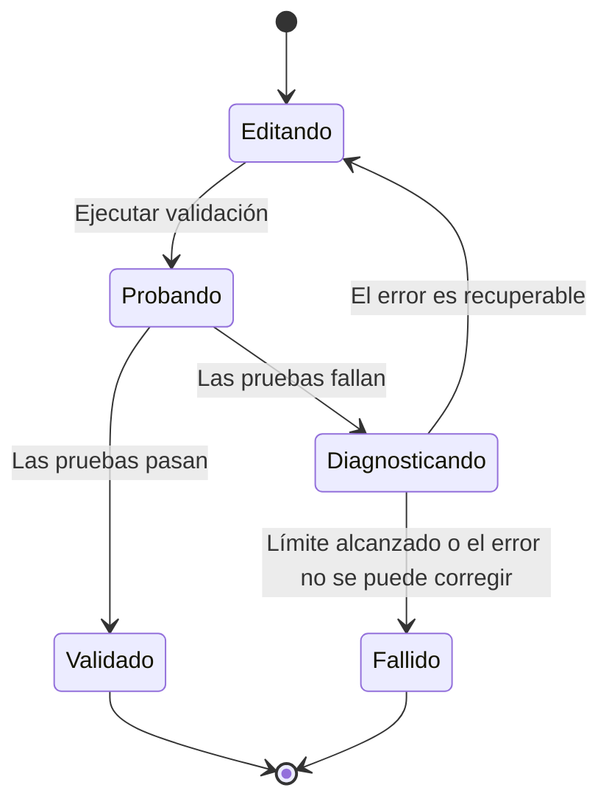
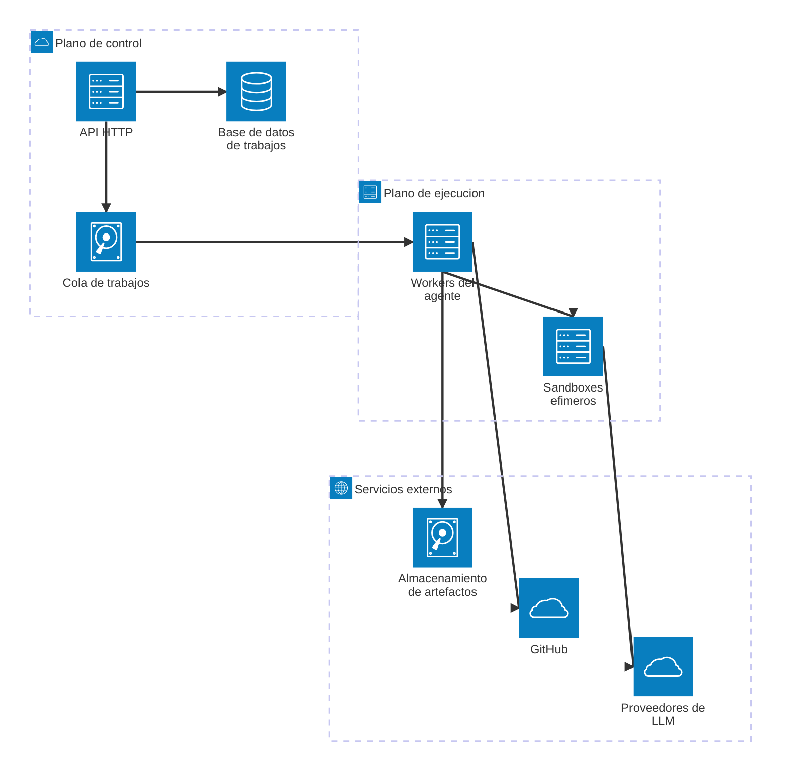
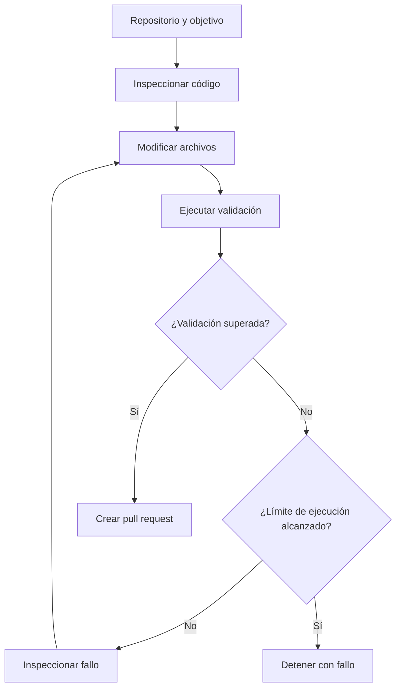

Queríamos que [BugLady](https://buglady.ai/) tomara un requerimiento de software y lo convirtiera en un pull request sin necesidad de que un desarrollador ejecutara un agente localmente.

BugLady ayuda a agencias y equipos de software a traducir las solicitudes de los clientes en trabajo sobre el que los ingenieros pueden actuar. El siguiente paso era obvio: en lugar de detenernos en un requerimiento aclarado, ¿podría el sistema implementarlo?

La primera versión de la idea era simple: ejecutar Claude Code en un servidor. Pero mover un agente de programación desde el portátil de un desarrollador hacia la nube cambia el problema. Ahora necesitas ejecución aislada, planificación de trabajos, credenciales, validación, recuperación ante fallos y una forma controlada de publicar el resultado.

Este artículo explica la arquitectura detrás de ese sistema y las decisiones involucradas al construir uno. Aquí tienes un breve recorrido del sistema en acción:

<iframe src="https://www.youtube.com/embed/vI58bDkONGo?si=M28eX4K4A8uzInOE" title="YouTube video player" frameborder="0" allow="accelerometer; autoplay; clipboard-write; encrypted-media; gyroscope; picture-in-picture; web-share" referrerpolicy="strict-origin-when-cross-origin" allowfullscreen></iframe>

## ¿Qué es un agente en la nube?

Un agente en la nube es un programa que se ejecuta de forma remota, utiliza un LLM y un conjunto de herramientas para realizar una tarea, y produce un artefacto o un efecto secundario.

Normalmente necesita cinco cosas:

* Un LLM
* Herramientas
* Un bucle de ejecución
* Ejecución remota
* Una definición de finalización

La parte remota importa. El agente podría ejecutarse en tu propio servidor, en Kubernetes, Railway, Fly.io, AWS u otra plataforma de cómputo. Lo que lo convierte en un agente en la nube es que el trabajo ocurre en un entorno gestionado en lugar de en la máquina del usuario.

La distinción no es simplemente "ChatGPT frente a un agente". Los asistentes interactivos responden a mensajes individuales. Un agente en la nube recibe un objetivo y sigue trabajando hasta que completa la tarea, alcanza un límite o falla.

Para BugLady, el objetivo podría ser:

> Agrega paginación al endpoint de usuarios e incluye pruebas.

El resultado no es una explicación de cómo agregar paginación. El resultado es una rama que contiene la implementación, pruebas que pasan y un pull request listo para revisión.

## ¿Por qué construir uno?

Un agente en la nube se vuelve útil cuando quieres que la IA participe en un flujo de trabajo existente en lugar de esperar a que alguien abra una ventana de chat, pegue el contexto y aplique manualmente la respuesta.

Un agente de programación puede implementar una función pequeña o corregir un error. Otros agentes podrían actualizar la documentación tras un lanzamiento, normalizar datos dentro de un pipeline, categorizar imágenes, moderar contribuciones o procesar solicitudes internas de soporte.

Estos trabajos tienen algunas cosas en común. Toman tiempo, requieren acceso a herramientas o datos, y necesitan producir algo que otro sistema pueda consumir.

Podrías pedirle a un asistente interactivo que te ayude con cada paso, pero alguien todavía tendría que coordinar el trabajo. Un agente en la nube permite que el flujo de trabajo invoque al agente directamente y reciba un resultado más tarde.

## Sigue una solicitud a través del sistema

La forma más fácil de entender la arquitectura es seguir una sola solicitud.

Un usuario hace clic en un botón pidiendo a BugLady que implemente un requerimiento. La API valida la solicitud y la coloca en una cola. Un worker recibe el trabajo, prepara el repositorio, inicia un entorno aislado e inicializa el harness del agente.

El harness le da al modelo acceso a herramientas. El modelo inspecciona el repositorio, edita archivos, ejecuta comandos, lee los resultados y decide qué hacer a continuación. Esto continúa hasta que la implementación pasa la validación o la ejecución alcanza uno de sus límites.

Cuando la tarea tiene éxito, el servicio extrae los cambios del repositorio y abre un pull request a través de una GitHub App.

El ciclo de vida se ve aproximadamente así:



Cada recuadro introduce una preocupación de ingeniería distinta.

## La API

Una API HTTP es suficiente para recibir la mayoría de las solicitudes de agentes.

Para nuestro agente de programación, un trabajo se parecía a esto:

```json
{
  "repository": "owner/project",
  "base_branch": "main",
  "goal": "Add pagination to the users endpoint and include tests",
  "model": "openai/gpt-5.6-terra",
  "provider": "openai",
  "limits": {
    "timeout_minutes": 30,
    "max_iterations": 40,
    "max_cost_usd": 5
  }
}
```

La API debería rechazar las solicitudes que el agente no debe procesar. Eso incluye repositorios inválidos, proveedores no soportados, ramas desconocidas, límites excesivos y objetivos de usuarios que no tienen acceso al proyecto.

Trata la solicitud como entrada no confiable. El objetivo eventualmente llega a un modelo con acceso a archivos y comandos, así que la autorización y la validación pertenecen al inicio del sistema, no dentro del prompt.

Los límites pueden proporcionarse por solicitud o configurarse en el servicio. Los límites por solicitud son útiles cuando distintos trabajos tienen distinto riesgo o complejidad. Los límites a nivel de servicio son más fáciles de gobernar.

## La cola

Los trabajos de un agente rara vez terminan dentro del tiempo de vida de una solicitud HTTP normal. Una tarea de programación podría tomar varios minutos, especialmente cuando el agente necesita instalar dependencias, inspeccionar un repositorio grande, ejecutar pruebas o recuperarse de un error.

La API debería aceptar la solicitud, crear un registro del trabajo, encolarlo y devolver un identificador de trabajo. Un worker puede entonces procesarlo de forma independiente.

La cola también controla la concurrencia. Sin ella, una ráfaga de solicitudes podría iniciar demasiados contenedores a la vez y agotar la memoria, la CPU, los límites de tasa del proveedor o tu presupuesto.

Como mínimo, el sistema de trabajos debería registrar:

* Estados: en cola, en ejecución, completado, fallido y cancelado
* Número de intentos
* Marcas de tiempo de inicio y finalización
* La etapa de ejecución actual
* La razón del fallo
* Los artefactos producidos
* El uso de tokens, cómputo y costo

Los reintentos deberían ser selectivos. Reintentar tras un error temporal del proveedor tiene sentido. Reintentar la misma suite de pruebas fallida cinco veces sin cambiar nada, no.

## El sandbox

El agente necesita un lugar donde trabajar. Ese entorno debería estar aislado del host y de los demás trabajos.

Usamos contenedores Docker. Para los primeros stacks soportados, mantuvimos imágenes para Node.js, Ruby, C#, Go y Java. Antes de iniciar el agente, el servicio inspeccionaba archivos como `package.json`, `Gemfile`, archivos de proyecto o la configuración de compilación para elegir una imagen.

La detección automática funciona para repositorios comunes. Los proyectos complejos eventualmente necesitan un archivo de configuración explícito. Agregamos un archivo `buglady.conf` para que un repositorio pudiera declarar su runtime, comandos de configuración, comandos de validación y otros requisitos en lugar de depender por completo de la detección.

Al iniciar un contenedor, el servicio decide:

* Qué imagen y versiones de dependencias usar
* Cuánta CPU y memoria recibe el trabajo
* A qué directorios puede acceder el agente
* Qué volúmenes se montan
* Qué variables de entorno están disponibles
* A qué direcciones de red puede llegar el contenedor
* Cuánto tiempo puede ejecutarse el proceso

El aislamiento protege al host, pero también hace que las ejecuciones sean reproducibles. Una tarea no debería tener éxito o fallar porque un worker resulte tener una versión distinta de Node, un paquete instalado globalmente o un archivo sobrante de otra ejecución.

Un sandbox efímero parte de un estado conocido y desaparece cuando el trabajo termina.

## El harness del agente

El harness del agente es el runtime en el centro del sistema.

Repetidamente envía al modelo el contexto actual, recibe ya sea texto o una solicitud de herramienta, ejecuta la herramienta solicitada, devuelve el resultado y decide si el bucle debe continuar.

De forma simplificada:



El harness también gestiona el estado de la conversación, los límites de iteración, las cancelaciones, las llamadas al proveedor, los esquemas de las herramientas, el registro (logging) y las condiciones de finalización.

Puedes construir este bucle tú mismo, pero para un agente de programación hay pocas razones para empezar desde cero. Los harnesses existentes ya manejan los flujos comunes de sistema de archivos, shell y edición de código.

Consideramos el SDK de Claude Code, OpenCode y Pi Mono. Elegimos Pi Mono porque era ligero y exponía una API que encajaba con la forma en que queríamos controlar la ejecución. La independencia del modelo también importaba porque queríamos usar distintos proveedores sin reconstruir el sistema que lo rodea.

La elección del framework debería seguir a la tarea. Un agente de flujo de trabajo general puede necesitar estado estructurado y herramientas de negocio personalizadas. Un agente de programación se beneficia de un harness ya diseñado para inspeccionar repositorios, modificar archivos y ejecutar comandos.

## Herramientas

Las herramientas son las operaciones que el modelo puede solicitar.

Para un agente de programación, comúnmente incluyen:

```text
read_file
write_file
search_code
list_directory
run_command
apply_patch
```

También podrías exponer herramientas para navegar documentación, consultar un rastreador de incidencias, leer una API interna o reportar el progreso.

Una herramienta no es código que el modelo ejecuta directamente. Es una capacidad registrada en el harness mediante un nombre, una descripción y un esquema de entrada.

La interacción funciona así:

1. El modelo recibe la tarea, el contexto y las definiciones de herramientas disponibles.
2. Decide que necesita una herramienta.
3. Devuelve una solicitud estructurada que contiene el nombre de la herramienta y los argumentos.
4. El harness valida la solicitud.
5. La herramienta se ejecuta dentro del entorno permitido.
6. El harness envía el resultado de vuelta al modelo.
7. El modelo decide qué hacer a continuación.

Supongamos que el modelo quiere inspeccionar un controlador:

```json
{
  "tool": "read_file",
  "arguments": {
    "path": "app/controllers/users_controller.rb"
  }
}
```

El harness verifica que la ruta esté permitida, lee el archivo desde el sandbox y devuelve su contenido. El modelo puede entonces solicitar una edición, ejecutar las pruebas, inspeccionar un error y editar el código de nuevo.

Las descripciones de las herramientas importan porque el modelo las usa para decidir cuándo y cómo llamar a cada herramienta. Pero las descripciones no son fronteras de seguridad. El runtime todavía necesita validar rutas, argumentos, duración de comandos, tamaño de salida y permisos.

## Cómo trabaja el agente con un repositorio

Cuando un worker recibe un trabajo de programación, clona el repositorio usando credenciales con el mínimo acceso necesario. Hace checkout de la rama base solicitada y crea una nueva rama siguiendo nuestra convención de ramas.

El repositorio se monta dentro del contenedor. El harness lo expone al modelo a través de herramientas de sistema de archivos y de comandos, manteniendo la ejecución dentro del sandbox.

El modelo puede ahora inspeccionar el código, identificar los archivos relevantes, implementar el cambio y ejecutar los comandos de validación del proyecto.

El harness debería centrarse en modificar y validar el repositorio. Las credenciales de GitHub no necesitan existir dentro del contenedor del agente. Una vez que la ejecución termina, el servicio externo puede inspeccionar los cambios, crear el commit, hacer push de la rama y abrir el pull request.

Esta separación reduce lo que un agente comprometido o confundido puede acceder. El agente necesita el código y las herramientas requeridas para trabajar en él. No necesita necesariamente permiso para publicar nada.

## Validación

La validación es lo que separa una demostración de un sistema que puedes colocar dentro de un flujo de trabajo real.

Para BugLady, la validación podría incluir:

* El proyecto se instala correctamente
* La aplicación compila
* Las pruebas existentes pasan
* Hay pruebas nuevas presentes cuando se requieren
* El linting y las comprobaciones de tipos pasan
* El repositorio contiene cambios reales

Un fallo de validación no debería terminar siempre la ejecución de inmediato. El resultado puede devolverse al modelo para que pueda inspeccionar el error e intentar corregirlo.

Por ejemplo:



La validación depende del trabajo. Un agente de procesamiento de datos puede validar contra un esquema, comparar conteos de registros o rechazar salidas con campos faltantes. Un agente de extracción podría requerir referencias a la fuente para cada valor devuelto. Un agente de procesamiento de imágenes podría verificar dimensiones, formato de archivo y resultados de moderación.

No trates que el modelo diga "la tarea está completa" como evidencia de que la tarea está completa. La finalización debería estar ligada a condiciones que el sistema pueda verificar.

## Artefactos

El artefacto es el resultado que sale del sistema del agente.

Para un agente de programación, suele ser un commit o un pull request. Otros agentes podrían crear un documento, subir archivos a almacenamiento de objetos, escribir registros en una base de datos, llamar a otro servicio o redactar un correo electrónico.

El artefacto debería preservar suficiente contexto para que una persona o un sistema aguas abajo pueda evaluarlo. Un pull request podría incluir el objetivo original, los archivos modificados, los comandos de validación, los resultados y cualquier limitación reportada por el agente.

Mantén la creación de artefactos fuera del modelo siempre que sea posible. El modelo puede preparar el contenido, pero código de aplicación determinista debería subir el archivo, crear el pull request o llamar al siguiente servicio.

## Recuperación ante fallos

Un agente en la nube tiene más modos de fallo que una aplicación normal de solicitud-respuesta porque depende de un modelo, proveedores externos, ejecución de herramientas, contenedores, dependencias del proyecto y validación específica de la tarea.

Algunos fallos son temporales:

* Timeout del proveedor
* Límite de tasa
* Fallo al descargar una imagen
* Interrupción de red
* Caída de un worker de la cola

Estos pueden reintentarse con backoff.

Otros requieren que el agente reaccione:

* Error de compilación
* Prueba fallida
* Forma de salida inválida
* Dependencia faltante
* Argumentos de herramienta malformados

El harness puede devolver el error al modelo y permitir otra iteración.

Algunos fallos deberían detener el trabajo:

* Timeout alcanzado
* Máximo de iteraciones alcanzado
* Límite de costo alcanzado
* Llamadas a herramientas idénticas repetidas
* Acceso prohibido a red o al sistema de archivos
* Límite de recursos del contenedor excedido
* Cancelación del usuario
* La validación sigue fallando tras los intentos permitidos

Almacena el estado de ejecución fuera del contenedor. Si el worker se cae, deberías seguir sabiendo qué trabajo se estaba ejecutando, hasta dónde llegó y si puede reanudarse o debe reiniciarse.

Los logs también necesitan estructura. Una transcripción larga de mensajes del modelo y salida de shell es difícil de depurar. Registra eventos como la creación del sandbox, la llamada a herramienta, la salida de un comando, el intento de validación, el error del proveedor y la creación del artefacto por separado.

Una protección útil es la detección de bucles. Si el modelo ejecuta el mismo comando fallido varias veces sin cambiar los archivos relevantes, el harness puede detener la ejecución o enviar una instrucción correctiva.

## Costo

El modelo es el costo más visible, pero no es el único.

Cada trabajo puede consumir:

* Tokens de entrada y salida
* CPU y memoria del contenedor
* Descargas de dependencias
* Ancho de banda por clonar el repositorio
* Acceso a la red
* Logs y trazas de ejecución
* Almacenamiento de artefactos
* Recursos de cola y base de datos

Los agentes de programación pueden enviar repetidamente grandes porciones de un repositorio o del historial de la conversación al modelo. La gestión del contexto, por lo tanto, afecta el costo tanto como la elección del modelo.

Registra el uso por trabajo en lugar de mirar solo la factura mensual del proveedor. Deberías poder responder cuánto cuesta una tarea exitosa, cuánto cuestan las ejecuciones fallidas, qué repositorios consumen más recursos y si los reintentos están mejorando los resultados o desperdiciando dinero.

Los presupuestos deberían aplicarse mediante el runtime. Un prompt pidiéndole al modelo que se mantenga por debajo de cinco dólares no es un control de presupuesto. El servicio debe contar el uso y terminar la ejecución cuando alcance el límite configurado.

El costo también influye en la arquitectura. Mantener un pool caliente de contenedores puede reducir el tiempo de arranque pero consume recursos mientras está inactivo. Construir dependencias en cada ejecución es más simple pero más lento y más caro. Las imágenes preconstruidas mejoran la velocidad, aunque mantener muchas combinaciones de lenguajes y frameworks genera su propio trabajo.

## Despliegue

Un primer despliegue no necesita Kubernetes.

Una versión práctica puede funcionar con:



La API recibe solicitudes y expone el estado de los trabajos. La base de datos almacena los trabajos, límites, estado y resultados. La cola asigna trabajo a los workers. Cada worker inicia un contenedor aislado para un trabajo y lo destruye después.

El host del worker necesita fronteras estrictas porque ejecuta código de repositorios y comandos seleccionados por un modelo. Evita montar el socket de Docker dentro de un contenedor del agente. No expongas credenciales del host. Restringe el tráfico saliente y ejecuta los contenedores sin privilegios de root cuando sea posible.

A medida que el uso crece, la API, la cola y los workers pueden escalar de forma independiente. Los trabajos de programación también pueden necesitar pools de workers separados para distintos perfiles de recursos. Una pequeña actualización de documentación no requiere la misma memoria o timeout que compilar un proyecto Java grande.

El primer problema de escalado a menudo no es el volumen de solicitudes. Es la diversidad de entornos. Soportar cinco lenguajes de programación significa soportar muchos gestores de paquetes, versiones, dependencias nativas, comandos de prueba y estructuras de proyecto.

Ese trabajo pertenece al diseño desde el principio. El modelo puede escribir código solo después de que el entorno pueda ejecutarlo.

## Conocimiento externo

No todo agente necesita generación aumentada por recuperación (RAG).

Algunas tareas requieren solo la solicitud y los archivos ya disponibles en el sandbox. Otras necesitan acceso a documentación, bases de datos, APIs internas, almacenamiento de objetos o un servidor MCP.

Trata el conocimiento externo como otra capacidad controlada. Dale al agente acceso solo a las fuentes requeridas para la tarea, y devuelve resultados estructurados cuando sea posible.

Para un agente de programación, navegar puede ayudar cuando necesita documentación actual de un framework. También introduce riesgo de red, riesgo de inyección de prompts, contenido no determinista y costo adicional. En repositorios con suficiente documentación local, deshabilitar el acceso general a internet puede producir una ejecución más controlada.

## Lo que más importa

El modelo es solo un componente de un agente en la nube.

El trabajo de ingeniería más difícil está a su alrededor: preparar entornos reproducibles, exponer herramientas acotadas, hacer cumplir límites, validar resultados, recuperarse de fallos y publicar artefactos de forma segura.

Para nuestro caso de uso, el bucle central era sencillo:



Todo lo demás existe para hacer que ese bucle sea lo suficientemente confiable como para ejecutarse sin que un desarrollador supervise cada comando.

## Conclusión

Construir un agente en la nube tiene menos que ver con hacerle prompting a un modelo y más con diseñar un sistema que pueda dejar que ese modelo actúe de forma segura y confiable.

La diferencia entre un demo y un agente listo para producción es el control: control sobre los entornos de ejecución, sobre lo que el agente puede acceder, sobre cómo gasta tiempo y dinero, y sobre cómo se valida y entrega su salida.

Si aciertas en esas piezas, el modelo se convierte en un componente poderoso en lugar de una dependencia frágil. Puede operar dentro de flujos de trabajo reales, producir artefactos en los que los equipos confían y manejar tareas sin supervisión humana constante.

Los agentes en la nube todavía están en una etapa temprana, y muchos patrones están evolucionando. Pero la idea central ya es clara: en lugar de pedirle respuestas a la IA, podemos darle responsabilidad sobre los resultados.
