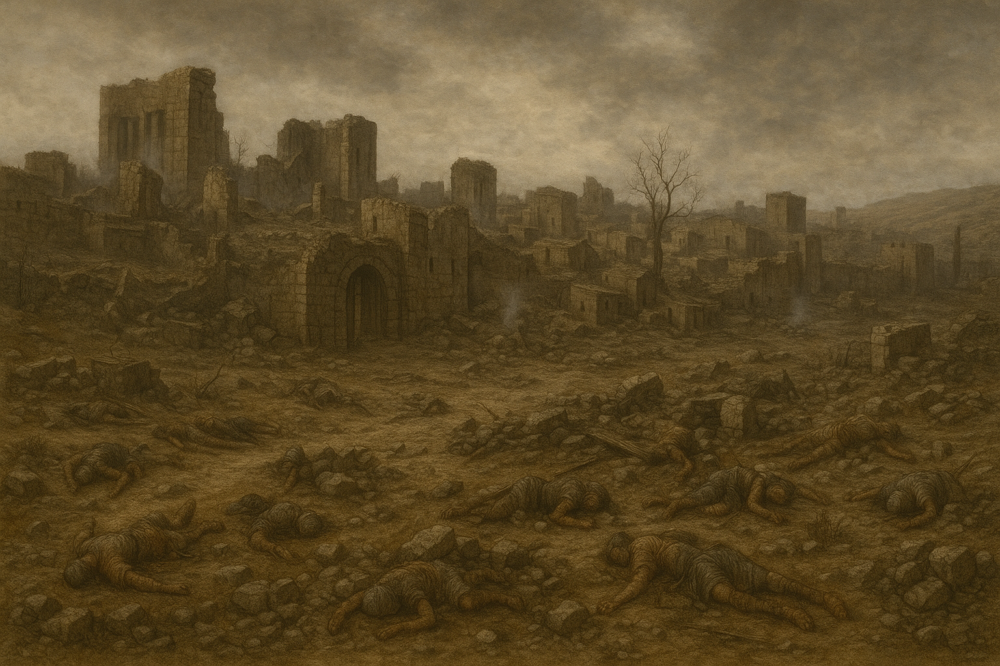
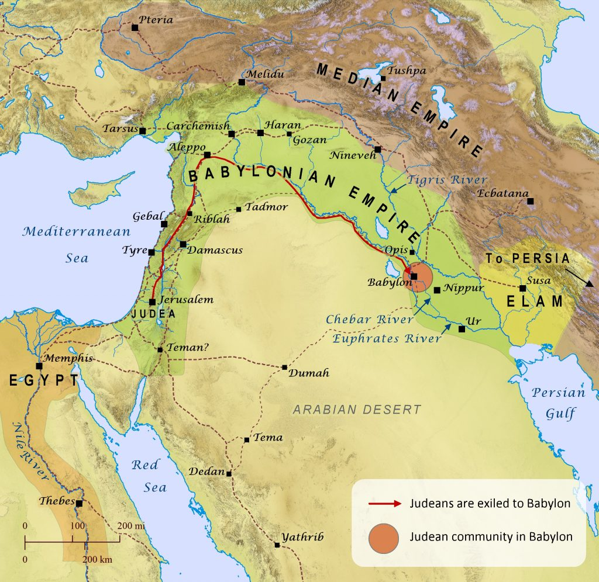
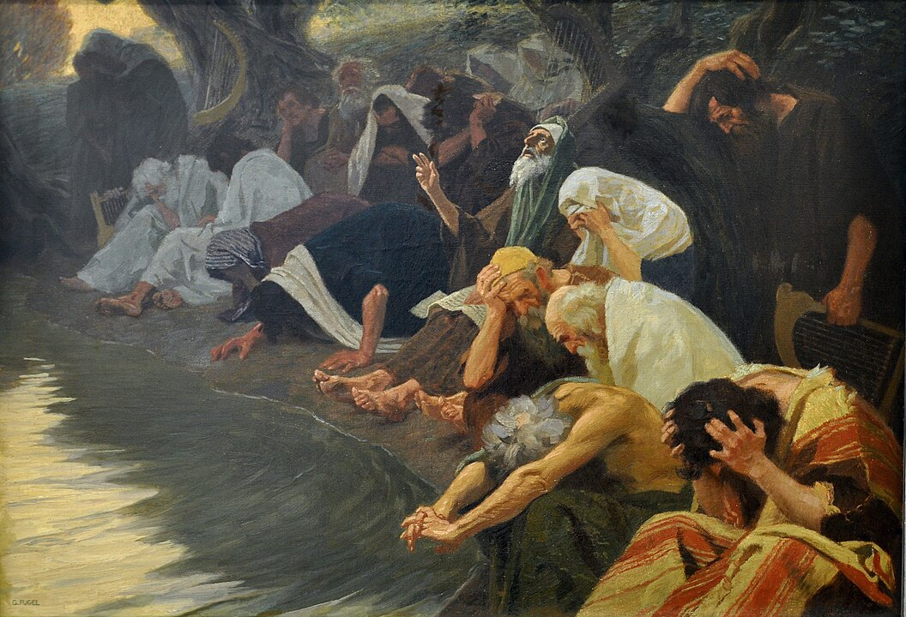

I’m currently doing a year-long Bible reading plan, and I’ve just arrived at the book of _Lamentations_. Right from the first verse, I was struck by its raw sorrow:

> “How lonely sits the city that was full of people!” — _Lamentations 1:1_

Reading this nearly 2,600 years after it was written, I realized how hard it is to grasp the full weight of what the destruction of Jerusalem and the exile to Babylon meant for the Jewish people. In this post, I want to take you with me on a journey to understand the depth of this trauma—the grief, the loss, and the theological crisis it sparked—and how it shaped biblical history.

# A Little Bit of Context

## The Kingdom in Crisis

The once-great Davidic kingdom was torn in two after Solomon’s death: the **kingdom of Israel** in the north, and the **kingdom of Judah** in the south, where Jerusalem and the Temple remained _(1 Kings 12:16–20)_. For the next **344 years**, both kingdoms experienced a steady spiritual decline — **Israel more rapidly**, and **Judah more slowly**.

You can trace this story in _1 & 2 Kings_, which parallel the reigns of the kings of both kingdoms:

- **Israel's kings**: none were described as righteous, leading the nation into idolatry and sin _(2 Kings 17:21–22)_.
- **Judah’s kings**: some were good (like Hezekiah and Josiah – 2 Kings 18:3, 22:2), but most led the people further away from God.

Throughout this period, the people committed many grievous sins:

- **Idolatry** _(Exodus 20:3–4)_ – They worshiped the gods of neighboring nations, building high places, Asherah poles, and altars to Baal. _(1 Kings 16:30–33; 2 Kings 17:10–12)_
- **Injustice** _(Deuteronomy 16:19)_ – Widows and the poor were oppressed, and leaders grew corrupt and greedy. _(Isaiah 1:23, Amos 5:11–12)_
- **Child sacrifice** _Leviticus 18:21_ – They offered their own children in fire to **Molech**, a horrific practice God had strictly forbidden. _(Jeremiah 7:31; 2 Kings 16:3; 2 Kings 21:6)_
- **Political compromise** _Isaiah 31:1_ – They trusted in alliances with Egypt, Assyria, and Babylon rather than in the Lord. _(2 Kings 18:21, Isaiah 30:1–3)_
- **Sexual immorality** _Exodus 20:14, Deuteronomy 23:17_ – Temple prostitution, adultery, and spiritual infidelity became common. (_Ezekiel 16:25–32, Hosea 4:12–14_)
- **Religious hypocrisy** _Isaiah 29:13_ – They observed rituals but their hearts were far from God. (_Jeremiah 7:9–11, Micah 6:6–8_)

## The Voice of the Prophets

In His mercy, **God sent prophets** to warn His people and call them back to righteousness.

### To Israel (the Northern Kingdom)

- **Amos**: _“Let justice roll down like waters...”_ (Amos 5:24)
- **Hosea**: _“Return, O Israel, to the Lord your God, for you have stumbled because of your iniquity.”_ (Hosea 14:1)

### To Judah (the Southern Kingdom)

- **Isaiah**: _“Though your sins are like scarlet, they shall be as white as snow...”_ (Isaiah 1:18)
- **Jeremiah**: _“Stand at the crossroads... ask for the ancient paths...”_ (Jeremiah 6:16)
- **Zephaniah**: _“Seek the Lord... seek righteousness, seek humility...”_ (Zephaniah 2:3)

These prophets exposed the nation’s sins and warned of impending judgment. They foretold that a powerful empire would come, destroy the land, and carry the people into exile.

> “If you do not listen... I will make this house like Shiloh and this city a curse for all the nations of the earth.” — _Jeremiah 26:6_

But they also preached hope:

- **If the people repented**, God would relent: _"Return to me, and I will return to you. – Zechariah 1:3"_
- **If they turned back**, He would restore.
- Even in judgment, they spoke of a coming **Messiah**, and a day of salvation for Israel and the nations.

Tragically, most prophets were rejected, persecuted, or even killed. The people **refused to listen**.

## The Fall of the Northern Kingdom

> “The Lord was very angry with Israel and removed them out of His sight.” — _2 Kings 17:18_

In **722 BC**, the **Assyrian Empire** invaded Israel, conquered its capital (**Samaria**), and exiled the ten northern tribes which tragically were lost to history.  
This was a confirmation of God’s judgment. Israel was no more.
In the time of Jesus, that region was known as **Samaria**, and its people — the **Samaritans** — were considered distinct and estranged from the Jews of Judah (John 4:9).

## The Rise of Babylon

As Assyria declined, **Babylon** rose to power under **King Nebuchadnezzar II**.  
Judah, still standing, found itself caught between **Babylon and Egypt**, and attempted to navigate politics through rebellion and shifting alliances — but they miscalculated.

Despite early deportations (like in **597 BC**, when **Ezekiel** and others were taken), Judah still refused to repent.  
They placed their trust in **military strength**, **foreign help**, and **religious rituals**, rather than genuine repentance and obedience to God.

Finally, in **586 BC**, Babylon returned.

# The Destruction of Jerusalem

That year, the Babylonian army broke through the walls of Jerusalem. Houses were looted, marketplaces destroyed, families scattered. And then, the unthinkable: the Temple of the Lord — reduced to rubble.

To a modern eye, it may seem like yet another ancient tale of conquest, like scenes from a historical epic where one empire sacks another. But for the Jewish people, this wasn’t just political or military defeat. It was a **collapse of their world**. Let’s begin with the most devastating blow:

## The Destruction of the Temple

To understand the magnitude of this loss, we need to see the Temple not merely as a building, but as the **spiritual heart of the nation**.

For the Jewish people, the Temple was the dwelling place of God’s manifest presence — _the Shekinah_. It was there that heaven touched earth. It was where sacrifices were offered to atone for sin (Leviticus 16), where prayers ascended like incense, where joy and solemnity met during festivals like Passover and Yom Kippur (Exodus 23:14–17), where the Ark of the Covenant stood. It was built not just with stone, but with **centuries of faith, memory, and covenant**.

This was the same God who had split the sea, fed them in the wilderness, and walked with them through fire and water. His presence had filled the Temple when Solomon first dedicated it (2 Chronicles 7:1–3). To lose the Temple wasn’t just losing a building — it was losing the **visible symbol of God’s favor**, the assurance that He was among them.

Imagine the songs of pilgrims as they ascended Mount Zion. The joy of the Day of Atonement. The smell of incense, the sound of trumpets, the prayers whispered toward the inner court. Now imagine all of it **turned to ash**. Foreign soldiers looted the sacred vessels and set fire to the Temple (2 Kings 25:13–17). The ark disappeared, never mentioned again. It was as if the **soul of the nation had been torn out**.

## The Destruction of the City

But the devastation didn’t stop at the Temple.

Jerusalem itself was seen as **the city of God**, the dwelling place of His Name (Psalm 48:1–3). Every year, Israelites from every tribe would make the pilgrimage to its gates. It was a city woven into their worship, memory, and identity.

> “If I forget you, O Jerusalem, let my right hand forget its skill.” — _Psalm 137:5_

To see it desecrated — its walls torn down, palaces burned, streets stained with blood — was to see a **nation’s heart laid bare**. It wasn’t just their capital. It was their **beacon of belonging**.

## The Fall of the Davidic Monarchy

And with the city fell the **line of David** — the royal house through which God had promised a coming Messiah (2 Samuel 7:12–16). King Zedekiah was captured, his sons slaughtered before his eyes, and then he himself was blinded and taken in chains to Babylon (2 Kings 25:6–7).

This wasn’t just the collapse of a dynasty. It raised devastating questions: Had God’s covenant failed? Was the promised Messiah just a dream?

## The Collapse of a National Identity

In just a matter of days, everything they had built over centuries — their kingdom, their worship, their leadership — was **swept away**.

They were no longer a people with a land, a king, or a temple. Their homes were destroyed. Their leaders were executed or exiled. Their treasures were plundered. Their sacred rhythms of life — festivals, offerings, prayers — were **interrupted with violence**.

# Exiled to Babylon

After the destruction of Jerusalem, the survivors were taken from the smoldering ashes of their homeland and marched in chains for hundreds of miles—eastward into captivity. They were exiled to **Babylon**, a vast, foreign, and idolatrous empire. This was not just **geographical displacement**—it was a **displacement of the soul**.

Some Jews fared better than others. Most became servants to Babylonian landlords or officials, working on farms, canals, or construction—labor that eerily echoed their ancestors’ bondage in Egypt (Exodus 1:11-14). Others, like **Daniel**, found themselves absorbed into the Babylonian court. They were given new names, forced to learn a foreign language and literature, and assimilated into the very culture that had destroyed their own (Daniel 1:3–7).

## A Bitter Parallel

Scholars and historians believe the exiles followed the **Fertile Crescent**, a route that curved north through Syria and then southeast along the Euphrates River—avoiding the deadly Arabian desert. Strikingly, this was the same route that **Abraham** once took in obedience to God, when he left **Ur of the Chaldeans** to enter the Promised Land (Genesis 11:31, 12:1–5).

How haunting that the very path once walked in **faith and promise** was now walked in **judgment and sorrow**.

_This image is by the <https://biblemapper.com/>_

Families were torn apart. Children were killed. The land promised to Abraham (Genesis 17:8), the city where David reigned (2 Samuel 5:7), the Temple where God's glory once filled the Holy of Holies (1 Kings 8:10-11)—**all gone**. The people who once declared, _“God is with us”_ (Isaiah 8:10), now sat enslaved and mocked in a land of strange gods and strange tongues.

You can almost hear the taunts of their captors:  
**“Where is your God now?”** (cf. Psalm 42:3)

# The Psychological and Theological Crisis

This was not just a national tragedy. It was a crisis of **faith, identity, and meaning**.

Many exiles must have echoed the same question:  
**Where is God now?**  
The God of Abraham, Isaac, and Jacob—the One who promised to dwell with His people and bless them. Had He **abandoned** them? Or worse, **rejected** them?

The exile shattered their foundational beliefs:

- Was the **covenant** broken? (Leviticus 26:14–33; Deuteronomy 28)
- Was the line of **David**—through whom the Messiah would come—cut off forever? (2 Samuel 7:12–16)
- Did God's **presence** leave them altogether?

Ezekiel, himself in exile, had a disturbing vision of the **glory of the Lord departing from the Temple** (Ezekiel 10:18–19)—a confirmation of what they feared most: God had left.

They had **no land**, **no temple**, **no sacrifices**, and **no king**. Everything that once made them God’s chosen people had seemingly been stripped away.

# How Shall We Sing the Lord’s Song?

> By the waters of Babylon,  
> there we sat down and wept,  
> when we remembered Zion.  
> — _Psalm 137:1_

Psalm 137 captures the raw, unfiltered grief of the exiles. They sat not just in sorrow—but in stunned silence. Their harps hung unused on the trees (Psalm 137:2), silent witnesses to their despair.

> “How shall we sing the Lord’s song  
> in a foreign land?”  
> — _Psalm 137:4_

Worship had once echoed through Jerusalem’s streets and temple courts. Now, **how could they praise**, when God seemed so far? Even their **identity as worshipers** was in crisis.

And yet—even in Babylon—they remembered:

> “If I forget you, O Jerusalem,  
> let my right hand forget its skill.”  
> — _Psalm 137:5_

Zion was not just a city. It was a symbol of God’s **faithfulness**, **presence**, and **promises**. They wept not only for their homes, but for what **Jerusalem meant**.

Psalm 137 ends in a deeply unsettling note—one of anguish, rage, and unresolved pain:

> “Blessed shall he be who repays you  
> with what you have done to us!  
> Blessed shall he be who takes your little ones  
> and dashes them against the rock!”  
> — _Psalm 137:8–9_

These are not moral prescriptions. They are **cries of wounded humans**—raw grief expressed in the only language they had left. This is the Bible not sanitizing human pain, but **exposing it**, letting lament speak where theology falls silent.

# A Painting That Speaks

I once came across a painting by **Gebhard Fugel**, titled _By the Waters of Babylon_. It brought the psalm to life in stunning clarity.

In it, the exiles slump by the riverbank, overwhelmed. Some press their faces to the ground. Others raise trembling hands. Their harps—those sacred instruments—hang forgotten in the trees, just as the psalm said.

The painting doesn't just depict history. It shows a **spiritual collapse**. A people emptied of song. A people hollowed by loss.

**They could no longer sing, because their hearts were broken.**

# A Flicker of Hope

And yet—not all was lost.

Even in Babylon, **faith quietly survived**. In small communities, the Jews gathered around elders. They practiced the **Sabbath** (Jeremiah 17:21–22), told stories, taught children, and prayed. With no temple, they learned to worship through **word, remembrance, and hope**.

This season birthed the **synagogue tradition**—spaces where Scripture was read, God was honored, and identity preserved. Exile did not destroy them. In many ways, it **refined them**.

And the prophets—while warning of judgment—also whispered of **restoration**:

> “I will take you from the nations…  
> and I will give you a new heart, and a new spirit I will put within you.”  
> — _Ezekiel 36:24–26_

> “Comfort, comfort my people, says your God.  
> Speak tenderly to Jerusalem… her warfare is ended.”  
> — _Isaiah 40:1–2_

They spoke of a day when exile would end, when God would dwell with His people again. A day when **a King would come**—a Servant who would carry their griefs and heal their wounds (Isaiah 53:3–5). A day when **death itself would be no more** (Isaiah 25:8).
