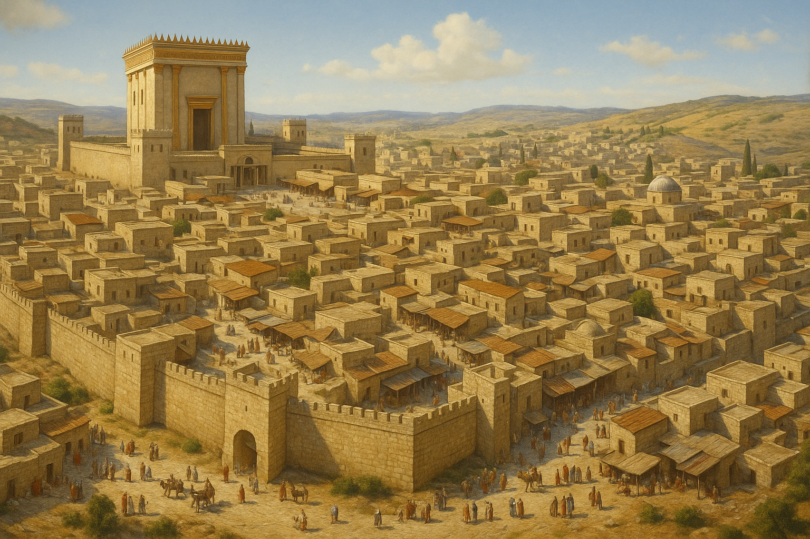

I’m currently doing a year-long Bible reading plan, and I’ve just arrived at the book of _Lamentations_. Right from the first verse, I was struck by its raw sorrow:

> “How lonely sits the city that was full of people!” — _Lamentations 1:1_

Reading this nearly 2,600 years after it was written, I realized how hard it is to grasp the full weight of what the destruction of Jerusalem and the exile to Babylon meant for the Jewish people. In this post, I want to take you with me on a journey to understand the depth of this trauma—the grief, the loss, and the theological crisis it sparked—and how it shaped biblical history.

# A Little Bit of Context

## The Kingdom in Crisis

The once-great Davidic kingdom was torn in two after Solomon’s death: the **kingdom of Israel** in the north, and the **kingdom of Judah** in the south, where Jerusalem and the Temple remained _(1 Kings 12:16–20)_. For the next **344 years**, both kingdoms experienced a steady spiritual decline — **Israel more rapidly**, and **Judah more slowly**.

You can trace this story in _1 & 2 Kings_, which parallel the reigns of the kings of both kingdoms:

- **Israel's kings**: none were described as righteous, leading the nation into idolatry and sin _(2 Kings 17:21–22)_.
- **Judah’s kings**: some were good (like Hezekiah and Josiah – 2 Kings 18:3, 22:2), but most led the people further away from God.

Throughout this period, the people committed many grievous sins:

- **Idolatry** _(Exodus 20:3–4)_ – They worshiped the gods of neighboring nations, building high places, Asherah poles, and altars to Baal. _(1 Kings 16:30–33, 2 Kings 17:10–12)_
- **Injustice** _(Deuteronomy 16:19)_ – Widows and the poor were oppressed, and leaders grew corrupt and greedy. _(Isaiah 1:23, Amos 5:11–12)_
- **Child sacrifice** _Leviticus 18:21_ – They offered their own children in fire to **Molech**, a horrific practice God had strictly forbidden. _(Jeremiah 7:31, 2 Kings 16:3, 2 Kings 21:6)_
- **Political compromise** _Isaiah 31:1_ – They trusted in alliances with Egypt, Assyria, and Babylon rather than in the Lord. _(2 Kings 18:21, Isaiah 30:1–3)_
- **Sexual immorality** _Exodus 20:14, Deuteronomy 23:17_ – Temple prostitution, adultery, and spiritual infidelity became common. _Ezekiel 16:25–32, Hosea 4:12–14_
- **Religious hypocrisy** _Isaiah 29:13_ – They observed rituals but their hearts were far from God. _Jeremiah 7:9–11, Micah 6:6–8_

## The Voice of the Prophets

In His mercy, **God sent prophets** to warn His people and call them back to righteousness.

### To Israel (the Northern Kingdom)

- **Amos**: _“Let justice roll down like waters...”_ (Amos 5:24)
- **Hosea**: _“Return, O Israel, to the Lord your God, for you have stumbled because of your iniquity.”_ (Hosea 14:1)

### To Judah (the Southern Kingdom)

- **Isaiah**: _“Though your sins are like scarlet, they shall be as white as snow...”_ (Isaiah 1:18)
- **Jeremiah**: _“Stand at the crossroads... ask for the ancient paths...”_ (Jeremiah 6:16)
- **Zephaniah**: _“Seek the Lord... seek righteousness, seek humility...”_ (Zephaniah 2:3)

These prophets exposed the nation’s sins and warned of impending judgment. They foretold that a powerful empire would come, destroy the land, and carry the people into exile.

> “If you do not listen... I will make this house like Shiloh and this city a curse for all the nations of the earth.” — _Jeremiah 26:6_

But they also preached hope:

- **If the people repented**, God would relent: _"Return to me, and I will return to you. – Zechariah 1:3"_
- **If they turned back**, He would restore.
- Even in judgment, they spoke of a coming **Messiah**, and a day of salvation for Israel and the nations.

Tragically, most prophets were rejected, persecuted, or even killed. The people **refused to listen**.

## The Fall of the Northern Kingdom

> “The Lord was very angry with Israel and removed them out of His sight.” — _2 Kings 17:18_

In **722 BC**, the **Assyrian Empire** invaded Israel, conquered its capital (**Samaria**), and exiled the ten northern tribes which tragically were lost to history.  
This was a confirmation of God’s judgment. Israel was no more.
In the time of Jesus, that region was known as **Samaria**, and its people — the **Samaritans** — were considered distinct and estranged from the Jews of Judah (John 4:9).

## The Rise of Babylon

As Assyria declined, **Babylon** rose to power under **King Nebuchadnezzar II**.  
Judah, still standing, found itself caught between **Babylon and Egypt**, and attempted to navigate politics through rebellion and shifting alliances — but they miscalculated.

Despite early deportations (like in **597 BC**, when **Ezekiel** and others were taken), Judah still refused to repent.  
They placed their trust in **military strength**, **foreign help**, and **religious rituals**, rather than genuine repentance and obedience to God.

Finally, in **586 BC**, Babylon returned.

# The Destruction of Jerusalem

That year, the Babylonian army broke through the walls of Jerusalem. Houses were looted, marketplaces destroyed, families scattered. And then, the unthinkable: the Temple of the Lord — reduced to rubble.

To a modern eye, it may seem like yet another ancient tale of conquest, like scenes from a historical epic where one empire sacks another. But for the Jewish people, this wasn’t just political or military defeat. It was a **collapse of their world**. Let’s begin with the most devastating blow:

## The Destruction of the Temple

To understand the magnitude of this loss, we need to see the Temple not merely as a building, but as the **spiritual heart of the nation**.

For the Jewish people, the Temple was the dwelling place of God’s manifest presence — _the Shekinah_. It was there that heaven touched earth. It was where sacrifices were offered to atone for sin (Leviticus 16), where prayers ascended like incense, where joy and solemnity met during festivals like Passover and Yom Kippur (Exodus 23:14–17), where the Ark of the Covenant stood. It was built not just with stone, but with **centuries of faith, memory, and covenant**.

This was the same God who had split the sea, fed them in the wilderness, and walked with them through fire and water. His presence had filled the Temple when Solomon first dedicated it (2 Chronicles 7:1–3). To lose the Temple wasn’t just losing a building — it was losing the **visible symbol of God’s favor**, the assurance that He was among them.

Imagine the songs of pilgrims as they ascended Mount Zion. The joy of the Day of Atonement. The smell of incense, the sound of trumpets, the prayers whispered toward the inner court. Now imagine all of it **turned to ash**. Foreign soldiers looted the sacred vessels and set fire to the Temple (2 Kings 25:13–17). The ark disappeared, never mentioned again. It was as if the **soul of the nation had been torn out**.

## The Destruction of the City

But the devastation didn’t stop at the Temple.

Jerusalem itself was seen as **the city of God**, the dwelling place of His Name (Psalm 48:1–3). Every year, Israelites from every tribe would make the pilgrimage to its gates. It was a city woven into their worship, memory, and identity.

> “If I forget you, O Jerusalem, let my right hand forget its skill.” — _Psalm 137:5_

To see it desecrated — its walls torn down, palaces burned, streets stained with blood — was to see a **nation’s heart laid bare**. It wasn’t just their capital. It was their **beacon of belonging**.

## The Fall of the Davidic Monarchy

And with the city fell the **line of David** — the royal house through which God had promised a coming Messiah (2 Samuel 7:12–16). King Zedekiah was captured, his sons slaughtered before his eyes, and then he himself was blinded and taken in chains to Babylon (2 Kings 25:6–7).

The royal lineage that once stood as a sign of divine promise now lay broken and disgraced. To the people, it must have seemed as though **God’s covenant had failed**, as though every promise of restoration and blessing had been annulled.

## The Collapse of a National Identity

In just a matter of days, everything they had built over centuries — their kingdom, their worship, their leadership — was **swept away**.

They were no longer a people with a land, a king, or a temple. Their homes were destroyed. Their leaders were executed or exiled. Their treasures were plundered. Their sacred rhythms of life — festivals, offerings, prayers — were **interrupted with violence**.

# Exiled to Babylon

After the destruction, the survivors were taken from the ashes of their homeland and marched hundreds of miles east into captivity. They were exiled to Babylon — a vast, foreign, and idolatrous empire. This was not just relocation. It was **displacement of the soul**.

Families were torn apart. Loved ones were killed. The land that had been promised to Abraham, the city where David once reigned, the Temple where God once dwelled — all of it was gone. The people who once believed, _“God is with us,”_ now found themselves mocked, enslaved, and powerless in a land of foreign gods and strange customs.

I just imagine what would the captors say to them: “Where is your God now?”

And so came the cry — the psalm of the exiles:

## How Shall We Sing the Lord’s Song?

> By the waters of Babylon,  
> there we sat down and wept,  
> when we remembered Zion.  
> — _Psalm 137:1_

They wept not only for their homes, but for their **lost identity**. They hung their harps on the trees (Psalm 137:2) — the very instruments that once resounded with worship — because how could they sing the Lord’s song in a land where He no longer seemed near? (Psalm 137:4).

> If I forget you, O Jerusalem,  
> let my right hand forget its skill.
> — _Psalm 137:5_

Even in exile, they clung to memory. The memory of Zion — not just as a city, but as a symbol of **everything they believed God had promised**. And yet, those memories were now soaked in grief, in longing, and in anger:

> Remember, O Lord, against the Edomites.
> the day of Jerusalem,  
> how they said, “Lay it bare, lay it bare,  
> down to its foundations!”  
> O daughter of Babylon, doomed to be destroyed,  
> blessed shall he be who repays you.
> with what you have done to us!  
> Blessed shall he be who takes your little ones.
> and dashes them against the rock!  
> _— Psalm 137:7-9_

These final verses are raw and unsettling. They don’t justify violence — they unveil **grief at full volume**. These are the words of those who have lost children, seen their cities burned, and their dignity trampled. Psalm 137 is not a call to vengeance. It is a cry from the **deepest human pain**, where praise and lament mix like ashes and tears.

While sitting with this psalm, I encountered a painting by Gebhard Fugel titled _By the Waters of Babylon_. It stopped me in my tracks.

In this piece, Fugel captures not just the historical moment, but the _spiritual collapse_ of a people in exile. The exiles are not merely sitting by a river—they are _collapsed_ by it. Their bodies slump toward the water as if their grief has gravity. Some press their foreheads to the ground, others clutch their heads in despair. A few raise trembling hands in prayer or protest. And there, hanging silently on the trees, are the harps—their sacred instruments—abandoned, silent.

The painting echoes the psalm:  
**They could no longer sing, because their hearts were broken.**

Worship was meant to echo through Jerusalem, not the foreign rivers of Babylon.Their faith, identity, and future were all in question.

# Psychological & Theological Crisis

